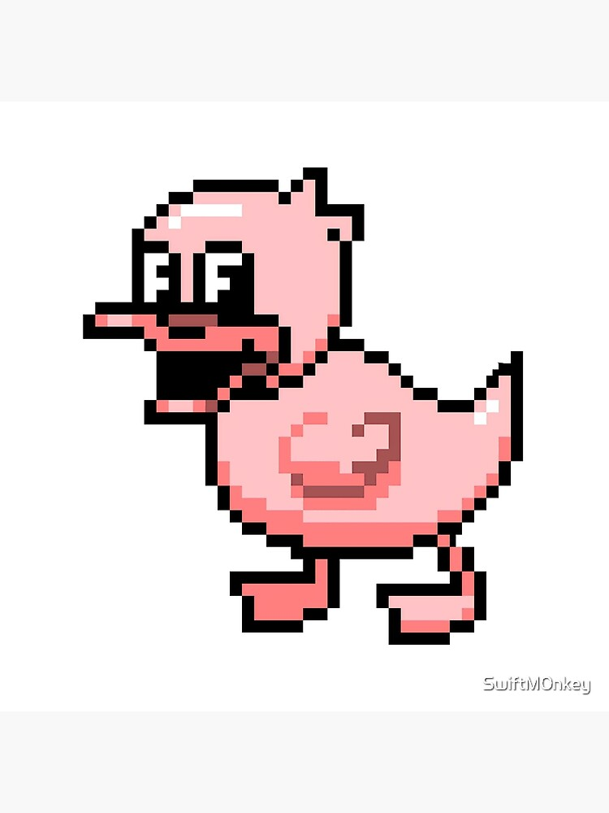

# Text Mining 2021

## Proyecto de word clustering

### ¿Que es word clustering?

Es el agrupamiento de palabras segun su relacion sintáctica. En este proyecto se utilizó el [algoritmo K-Means](https://es.wikipedia.org/wiki/K-medias)

### ¿Como se hizo el proyecto ? (Procedimiento)

### Procesamiento de palabras

1. Separamos el corpus (texto a analizar) en oraciones.
2. Filtrado de oraciones con menos de 5 palabras, por ser consideras poco informativas.
3. Se separaron las oraciones en palabras.
4. Lemmatizamos (Convertimos cada palabra a una forma "estandar") cada palabra.
5. Contamos la ocurrecia de cada lemma en el corpus.
6. Se creo un diccionario de lemmas.
    * Se agregaron todas los lemmas que no representaran números ni puntaciones.
    * Cada entrada del diccionario es en si mismo otro diccionario, que contiene:
        * Palabras del contexto, en una ventana de dos palabras atras y dos adelante.
        * Tag del part-of-speach
        * Funcionalidad
    * En el diccionario no se agregaron palabras poco frecuentes, segun un threshold arbitrario, al igual que las palabras de contexto contexto
7. Vectorizacion de las palabras
8. Normalizacion de las matriz de las palabras vectorizadas

#### Clustering

Se utilza el algoritmo K-Means para generar un numero predeterminado K de clusters, tomando como medida de distancia el coseno del vector-palabra.
Se iteró con 3 valores: 50,100,150.

#### Información Detallada

##### La informacion detallada del proyecto se encuentra en la notebook del mismo, junto con el código

Para finalizar , un pato: 